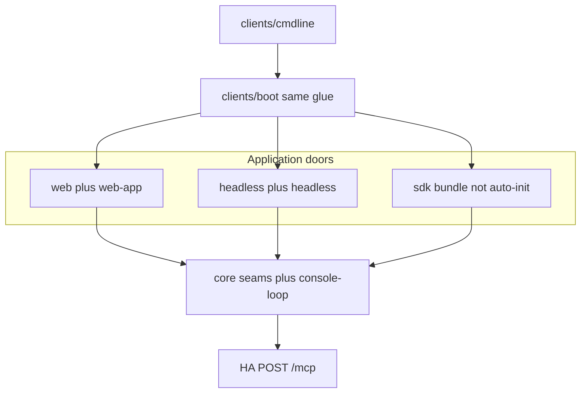

# Cordis console (Kitchen A / UI)

**Status:** planned. **Blocked** on [Host Agent Cordis kernel](./2026-08-26-host-agent-cordis-kernel.md) **ha-k4**.

**Sibling:** [Host Agent Cordis kernel (Kitchen B)](./2026-08-26-host-agent-cordis-kernel.md)

This plan is the TypeScript console half of “two kitchens, one MCP slot”: Hermes-style **web workbench** + **headless one-shot CLI**, same boot, same loop. Code lives in this repo under `clients/`. Delete [`opute/apps/opute-tui`](../../../opute/apps/opute-tui) when the canary is green. Commercial `platform.opute.io` stays in `opute/` and must not import this tree.

Do **not** clone `@deepseek-ai/dsh-agent-loop`, DSH `client/`+`host/` dual-process Web, or Opute `@opute/cordis` / `@opute/shared`. Do **not** put `plan.Runner` or host mutations in TypeScript.

Authoritative DSH shape (console only): [Architecture](https://deepseekdocs.com/en/docs/learn/intro/architecture), [What is DSH](https://deepseekdocs.com/en/docs/learn/intro/what-is-dsh), [Plugin anatomy](https://deepseekdocs.com/en/docs/learn/core/plugin-anatomy), [Boot and configuration](https://deepseekdocs.com/en/docs/learn/core/boot-config), [Configuration](https://deepseekdocs.com/en/docs/user-guide/configuration), [Credentials](https://deepseekdocs.com/en/docs/user-guide/credentials), [Agent loop](https://deepseekdocs.com/en/docs/learn/core/agent-loop), [Context](https://deepseekdocs.com/en/docs/learn/core/context), [Drive from a program](https://deepseekdocs.com/en/docs/guides/drive-harness-from-program).

## Shared model (both plans)

Hold two kitchens. They never share a counter. They only pass tickets through a slot in the wall.

| Kitchen | Plan | Owns |
| --- | --- | --- |
| **A — thinking** | this plan | Occupant (human or Granite), session log, system prompt, model-visible tools, approval, widgets, loop |
| **B — doing** | [kernel plan](./2026-08-26-host-agent-cordis-kernel.md) | Typed host capabilities: plans, catalog, embed/rerank/chat when the station is active |

**The slot is MCP 2026-07-28** (`http://127.0.0.1:3014/mcp`). Console writes tickets. It never cooks host food. It never dials `:11434`.

Cordis here: plugins, loader, `ctx.llm`, `ctx.sessions`, `ctx.agents`, `ctx.tools`, `ctx.systemPrompt`, the agent loop. Go must not learn those keys.

Rule: if Granite *saw* it, it is in the log; if it is not in the log, Granite did not see it.

Granite never gets selector IDs; humans still see them on their side of the glass ([ADR 0005](../../docs/adr/0005-typed-result-selector-boundaries.md)).

If the trio is missing from Kitchen B’s menu, this kitchen seats a human (C-11). Kitchen B does not grow an occupant mode.

Two gates: this kitchen **approval** (default: human; Granite must not auto-approve), then Kitchen B **admission**.

`web`, `headless`, and (after g-09) **SDK stdio** are doors into this kitchen, not extra kitchens. SDK is Program → A; MCP remains A → B.

## Product

Two built-in applications, one loop:

- `console web` / `console --profile web` — Hermes-style workbench
- `console --profile headless "get the vm info"` — one-shot, then exit

`dsh run` is gone; we do not invent a third `run` command. After the canary, a third **door** (SDK) embeds this kitchen; it is not a third kitchen.

“Get the vm info”: embed recall → bounded rerank → Granite tool-calls with **opaque URIs** from sanitized JSON. Human path: search → list → selector overlay.



## DSH mapping

Three layers ([architecture §2](https://deepseekdocs.com/en/docs/learn/intro/architecture)):

- **Application** — `web` workbench vs `headless` one-shot (which plugins load)
- **Core services** — same seams in every mode
- **Composition** — Cordis Context, inject, events, isolate

| DSH | Ours |
| --- | --- |
| `dsh web` | `console web` |
| `dsh --profile headless "…"` | `console --profile headless "…"` |
| `packages/bundle/base` | `clients/bundle/base` |
| `packages/bundle/web-app` | `clients/bundle/web-app` |
| `packages/bundle/headless` | `clients/bundle/headless` |
| `boot/` + `apps/cli` | `clients/boot` + `clients/cmdline` |
| `dsh web --dump-config` | same flags on **both** profiles |

Headless: positional prompt → inbox `followup` → terminal step → print model-visible outcome → `process.exit`. Stdout is human/CI text. Not OpenTUI, not NDJSON TUI, not the SDK door (SDK owns stdout for protocol frames).

Web: same loop; `web-app` mounts prompt/catalog/gate/result/task/status rows; process stays alive; HMR on the user patch. Browser → HA `:3014/mcp`. Do not copy DSH dual-face Node `:3080`.

**Seam = definition package ≠ implementation package.** `clients/core/llm` declares `ctx.llm` with zero Ollama knowledge; `clients/host-agent/llm` implements it over MCP against the generation-activated catalog from [ha-k4](./2026-08-26-host-agent-cordis-kernel.md#ha-k4--adr-0002--granite-trio).

**One tool-call path:**

```text
web widget send()  OR  headless argv prompt  OR  SDK session/prompt
  -> inbox claim
  -> agent/pre-step
  -> assemble: ctx.systemPrompt + tool schemas + deriveModelHistory()
  -> occupant seats (human | Granite)
  -> ctx.llm provider (HA Granite) OR skip if human bound the call
  -> tools/* waterfall; default execute = hostMcp.tools/call
  -> append session log (model-visible subset)
  -> web: UI renders session/event
     headless: print + exit when the turn is terminal
     sdk: session.event + session.status idle; caller owns the interval
```

## Close in v1

**Session log.** `$CONSOLE_HOME` event-sourced log (`session.jsonl`). `deriveModelHistory()` is the only model projection (strips selectors). Log `request/header`. No compaction/token-meter.

**Agent/tools/inbox/turn/step.** One `console-loop`, not vendored `dsh-agent-loop`. Inbox `followup` / `steer` / `inject`. Default `tools/execute` is `hostMcp.tools/call`. `ABORTED_BEFORE_DISPATCH` if never dispatched. Plugin failure ends the **turn**. Cancel aborts SSE then `tasks/cancel`. HA does not subscribe to these events.

**Profiles / isolate.** Empty `cordis.yml`; 100% from patches. Built-in templates: **`web`** and **`headless`** only. Occupant-model isolate cannot see `LineState` selectors.

**Web roster.** Each widget is a `console.client` row. Headless does not mount them. `--patch` can disable a web widget without editing TS.

## Configuration

Adopt [Configuration](https://deepseekdocs.com/en/docs/user-guide/configuration) **layers**, not their LLM settings. Kitchen B does not grow `settings.yaml`.

Profile dir (`$CONSOLE_HOME/profiles/<web|headless>/`, not `~/.dsh`). Package manager is **Bun**:

```text
$CONSOLE_HOME/profiles/web/
  cordis.yml              # empty; rewritten every start
  cordis.patch.yml        # deployer mount layer
  package.json            # console.profile.bundles
  bun.lock
  workspaces              # out-of-tree plugins
  node_modules/
```

Plus `$CONSOLE_HOME/cordis.patch.yml` (machine overlay).

| | `cordis.patch.yml` | `$CONSOLE_HOME/settings.yaml` |
| --- | --- | --- |
| Who | Deployer | User at runtime |
| How | Edit; web HMR on profile patch | UI / hot-publish (`settings-file` in `base`) |
| What | Plugin rows | Prefs shared by every door |

Patch: `config` is whole-row replace; mismatched `name` → skip; locate by `id`.

**settings.yaml may:** approval default (human), occupant override (force human), MCP URL default `http://127.0.0.1:3014/mcp`, optional catalog-name of an **already-published** HA language capability.

**settings.yaml must not:** `agent-default-model` / `llm-pi-ai` / `baseURL`; secrets; `danger-full-access`.

Layered env: process > project `.env` > `$CONSOLE_HOME/.env`.

Credentials pattern (not `dsh-credentials`): `ctx.credentials`; references only (`MCP_AUTH_TOKEN`); env wins and is read-only; `$CONSOLE_HOME/.credentials.yaml` 0600. Not Ollama keys. Never pass the path to the model.

Diagnose: `console web --dump-config` / `--dump-default-config`.

## SDK door (after canary)

[Drive harness from a program](https://deepseekdocs.com/en/docs/guides/drive-harness-from-program): **Program → Kitchen A**, not a wire to Go. Adopt the **pattern**, not `@deepseek-ai/dsh-sdk-*`.

- Plugin injects `agents`; newline JSON-RPC on stdio; stdout = frames; stderr = diagnostics
- `session/prompt` returns `{ messageId }` immediately; wait for `session.status` idle
- Handshake `runtime/configure` — **never** MCP `initialize`, never sent to `:3014`
- `clients/bundle/sdk` on `base`; not an auto-init profile
- No Python SDK; no subagent notifications until we have subagents
- Blocking human approval: fail closed for embedders (or use the web door)

Headless and SDK cannot share stdout.

## Layout

- `clients/boot` — profile resolve, composeEntries, dump-config, fail-loud, isolate
- `clients/cmdline` — `console web` and headless one-shot
- `clients/core/*` — seams only (`loop`, `sessions`, `systemPrompt`, `agents`, `tools`, `approval`, `settings`, `credentials`, …)
- `clients/host-agent/*` — MCP, llm/embed/rerank providers
- `clients/bundle/base|web-app|headless` — patch YAML
- `clients/web` — workbench widgets
- `clients/sdk-jsonrpc-server`, `clients/sdk-client`, `clients/bundle/sdk` — g-09

`cmd/` / `internal/` never import `clients/` ([kernel plan](./2026-08-26-host-agent-cordis-kernel.md)).

## Leave

- DSH dual-face host (`client/` + Node `host/` + `/api` + `window.__DSH_BOOT__`)
- Interactive OpenTUI / `tui` profile as the CLI twin (DSH: `tui` is self-built). Delete `opute-tui`; do not replace it with a second visual UI
- `ctx.fs` / shell / sandbox / subagents / goals / `ctx.jobs` (tasks via `hostMcp`)
- Vendoring `dsh-agent-loop` or `dsh-sdk-*`
- Hosting extra MCP servers as `ctx.tools`
- Skills / Code Mode / compaction+token-meter
- Selectors as model tools
- JSON-RPC stdio on Kitchen B
- Settings that add a second LLM stove

## Work items

Windows Beads ledger. Console coding (`g-02`) is blocked until **[ha-k4](./2026-08-26-host-agent-cordis-kernel.md#ha-k4--adr-0002--granite-trio)**. Program done = **ha-k4 + g-06 + g-08**. g-09 is after the canary, not a gate for deleting `opute-tui`.

### g-00 — ledger

Kitchen A invariants: model-visible-means-logged, no host cooking, selectors behind glass, Go unaware of harness `ctx`.

### g-02 — boot + headless

`clients/boot` + cmdline; profile dir tree; patch vs `settings.yaml`; layered env; credentials 0600; `base` + `headless`; dump-config; fail-loud (`console:` prefix); isolate; one-shot exit; human occupant via stdin.

### g-03 — loop + session log

Full agent/tools/inbox/turn/step; `session.jsonl`; LineState (web prompt + headless approval stdin); `systemPrompt`; `request/header`; approval; selector-stripped `deriveModelHistory`. Keep `ctx.agents` so g-09 can inject it.

### g-04 — web workbench

`web-app` bundle + widget roster + `--patch`; tasks/SSE via `hostMcp`.

### g-05 — docs

Rewrite AGENTS/ADR/README/RFC/skills in present tense; kill initialize docs. Coordinate HA wording with [kernel docs](./2026-08-26-host-agent-cordis-kernel.md#docs-in-this-repo-with-ha-k4--with-console-g-05). Reanchor `tui-design-language` / selector decisions onto harness tests + **web** widgets. Headless has no selector overlay; opaque URIs or fail closed.

### g-06 — delete TUI

Delete [`opute/apps/opute-tui`](../../../opute/apps/opute-tui) and `build:opute`. RFC 0001 reclassified as this console (`web` + `headless`). Headless NDJSON TUI protocol is not this product.

### g-08 — occupant-model canary

TS `ctx.llm` / embed / rerank provider rows; occupant-model; `console --profile headless "get the vm info"`; missing trio → human (stdin or non-zero).

### g-09 — SDK door

Stdio JSON-RPC plugin (`inject: agents`); `ConsoleHarness.run()` receipt → idle; no dsh-sdk vendor.

## Validation (after ha-k4)

- Import graph: `base` and `headless` have no react; `web-app` widgets do not call MCP SDK
- `console --profile headless "get the vm info"` exits 0 after a terminal turn; missing trio → human stdin or non-zero if non-interactive
- After g-09: spawn Kitchen A over stdio; `session/prompt` returns `messageId` immediately; stdout has only JSON-RPC frames; HA still only sees `POST /mcp`
- `console web --dump-config` shows `web-app` widget rows; headless `--dump-default-config` does not
- `$CONSOLE_HOME/profiles/web/cordis.yml` is empty after boot; patch `config` is whole-row replace
- `settings.yaml` occupant override is visible to web and headless; it cannot add an LLM `baseURL`
- `MCP_AUTH_TOKEN` in process env is not writable via credentials; `.credentials.yaml` is 0600; dump-config never prints the secret
- Reranker fixture adding an unauthorized name abstains
- Live: three probes resident; intent binds a URI; `--patch` removes catalog widget on web
- Boot failure prints `console:` and exits 1
- Replay of `session.jsonl` through `deriveModelHistory()` equals what Granite was sent; human LineState still has selector ids
- Occupant-model isolate cannot read LineState selector fields
- Opute typecheck without `opute-tui`
