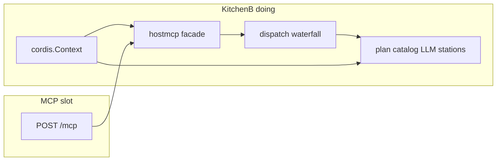

# Host Agent Cordis kernel (Kitchen B)

**Status:** planned. Blocks the TypeScript console until **ha-k4**.

**Sibling:** [Cordis console (Kitchen A / UI)](./2026-08-26-cordis-console.md)

This plan is the Go Host Agent half of “two kitchens, one MCP slot.” Implement this first. The console must not start until the waiter is only a waiter and the Granite trio is a generation-activated catalog, not `ops.Ollama`.

Authoritative for this repo: [`docs/cordis-development-guide.md`](../../docs/cordis-development-guide.md), [ADR 0002](../../docs/adr/0002-provider-extension-architecture.md), C-01–C-24, [`host-agent-boundaries`](../skills/host-agent-boundaries/SKILL.md), [`cordis-go`](../skills/cordis-go/SKILL.md).

## Shared model (both plans)

Hold two kitchens. They never share a counter. They only pass tickets through a slot in the wall.

| Kitchen | Repo / tree | Owns | Cordis means |
| --- | --- | --- | --- |
| **A — thinking** | [console plan](./2026-08-26-cordis-console.md) (`clients/` + delete `opute/apps/opute-tui`) | Occupant, session log, system prompt, model-visible tools, approval, widgets, loop | Plugins, loader, `ctx.llm`, `ctx.sessions`, agent loop |
| **B — doing** | this plan (`cmd/`, `internal/`, `plugins/`) | VM/plan/catalog/Ollama, admission, evidence | Plugins, fibers, generations, admission. **Not** a chat session |

**The slot is MCP 2026-07-28.** `POST /mcp`, `tools/call`, catalog revision, tasks. No shared `ctx`. No “Go, please be the agent loop.”

Go `cmd/` / `internal/` / `plugins/` must **not** name, import, or implement `ctx.llm`, `ctx.agents`, `ctx.sessions`, `ctx.tools`, or `ctx.systemPrompt`. Those keys exist only in Kitchen A.

If chat/embed/rerank are missing, Kitchen A seats a human. Kitchen B does **not** grow a human-occupant mode. The language station is simply not on the menu (C-11).

`open_assistant_session` is a **catalog/contract stamp at the slot**, not Kitchen A’s session log. Do not grow it into `ctx.sessions`.

[`internal/console`](../../internal/console) stays VM PTY streams. Do not turn it into a web host.

Kitchen A never runs [`plan.Runner`](../../internal/plan) (C-03). Two gates, do not collapse them: A **approval**, then B **admission**.

## Today’s bug

Cordis is a closet. [`internal/hostmcp/server.go`](../../internal/hostmcp/server.go) is the composition root: catalog, dispatch, tasks, recipes, providers, streams, plus a duplicated tool-name `switch` in both `DispatchTool` and `handleToolCall`. [`internal/tools/dispatch.go`](../../internal/tools/dispatch.go) is a large name switch over `HostOperationsService`. `cordis.NewContext()` exists only as `providerContext` for generations. [`internal/ops/ollama.go`](../../internal/ops/ollama.go) still mixes LLM with generic host ops (ADR 0002 unfinished).

The waiter *is* the restaurant.

## Target

Kitchen B’s Cordis becomes the **floor plan**. The MCP server is only the **waiter** at the slot. Ticket in → waterfall (allowed? menu current?) → the right station. Ollama is a station you **activate**, not a special drawer in `ops`.

Do **not** add a Go loader, bundles, `$CONSOLE_HOME`, HMR, occupant isolate, agent/tools waterfalls, dual-face `/api`, or JSON-RPC stdio on this process. That is [Kitchen A](./2026-08-26-cordis-console.md).

## Work items

Windows Beads ledger ([agent-work-coordination](../../../opute/.agents/skills/agent-work-coordination/SKILL.md)). Kernel done = **ha-k4**. Console coding is blocked until then.

### ha-k0 — ledger

Capture: waiter vs floor plan; C-11 is a menu gap; Go unaware of harness `ctx` keys; two kitchens, one wire.

### ha-k1 — one process Context

- Boot mounts plugins whose `Inject` graph **is** the boot order: catalog, admission, tasks, plan runner, evidence, public MCP transport, resource services.
- Failed `Apply` disposes the fiber (C-09). No growing handwritten sequence in `NewServer` after the initial `ctx.Plugin` list.
- [`hostmcp.Server`](../../internal/hostmcp/server.go) becomes the public MCP **façade**: translate `tools/call` → service method. It does not own composition, lifecycle maps, or a second copy of the lifecycle tool list.

Layout after this: `cmd/` mounts `cordis.Context`; `internal/cordis` kernel; `internal/hostmcp` façade; `internal/cordis/mcp` + `internal/transport` edge. `cmd/` / `internal/` never import `clients/`.

### ha-k2 — dispatch waterfall

- Admission, catalog-revision check, standalone mutation gate, and provider-vs-builtin routing become deny-only waterfall listeners ([typed events](../../docs/cordis-development-guide.md)).
- Lifecycle tools (`run_host_plan`, `opute.provider.install`, …) are methods on the plan/provider plugins, not cases copied in two functions. `DispatchTool` / `handleToolCall` duplication dies.
- Existing builtins wrap as **one** `builtinTools` plugin so the remaining name switch is internal to that plugin, not the server. New capabilities (embed, rerank, chat) are their own plugins. Do not rewrite every Incus tool before the console; do not add more cases to `Server`.
- MCP tool names stay on the wire. Cordis sees `ServiceKey`s. MCP opacity stops at [`internal/cordis/mcp`](../../internal/cordis/mcp) (C-14).

### ha-k3 — transport edge

- Origin present+invalid → 403 on `POST /mcp` in [`internal/transport/http.go`](../../internal/transport/http.go). Kernel never sees headers.
- MCP 2026-07-28 only: **no `initialize` by default** (the compatibility gate is bounded by [ADR 0011](../../docs/adr/0011-legacy-handshake-compatibility-gate.md); the unqualified claim was false — `OPUTE_MCP_ALLOW_LEGACY_HANDSHAKE` has always admitted it), no `Mcp-Session-Id`, `MCP-Protocol-Version`, tasks SSE. Bind `127.0.0.1`. `MCP_AUTH_TOKEN`.
- **`server/discover`** is part of this edge, not an extension afterthought. It is the 2026-07-28 capability-discovery method and was missing from this checklist entirely (modular plan §2.2); it lands in `internal/transport/discover.go` and stays validated even under the legacy gate.
- **Modern-request gating** is the `Mcp-Method` header plus `_meta["io.modelcontextprotocol/protocolVersion"]` (`validateModernMCPRequest` / `isModernMCPRequest`). Preserve both through the split: the bypass is bounded to the enumerated `legacyCompatibleMethods` set, and `TestLegacyCompatibleMethodsAreServed` asserts every entry names a method this server actually answers.
- Contract coverage lives in [`test/compliance/mcp_test.go`](../../test/compliance/mcp_test.go), [`internal/transport/modern_test.go`](../../internal/transport/modern_test.go) and [`internal/transport/http_test.go`](../../internal/transport/http_test.go). These already cover `server/discover` and the header gating against the current handler; the split must carry them onto the new seam rather than leave them testing the old one.
- Kill initialize/session language in [`npm/local-host-agent/README.md`](../../npm/local-host-agent/README.md) as part of this edge (console plan also rewrites client docs).

### ha-k4 — ADR 0002 + Granite trio

- Ollama leaves [`internal/ops/ollama.go`](../../internal/ops/ollama.go) as a **candidate → ready → active** provider generation ([`plugins/llm/ollama`](../../plugins/llm/ollama)). Core stays usable with no LLM (C-11).
- Pins:
  - Chat: `hf.co/ibm-granite/granite-4.2-3b-GGUF:Q4_K_M`
  - Embed: `hf.co/mradermacher/granite-embedding-small-english-r2-GGUF:Q4_K_M`
  - Rerank: [granite-embedding-reranker-english-r2](https://huggingface.co/ibm-granite/granite-embedding-reranker-english-r2)
- Replace `DefaultOllamaModel` (today LFM2) and `localLLMModelRole` (today rejects `reranker`). Policy: one generation + one embedding on Ollama; reranker is a serialized third resident; one request at a time across all three.
- Public catalog: `install` / `probe` / **embed** / **rerank** / chat. Rerank **abstains** if it names a tool outside recall (copy rules from [`opute/packages/shared/src/agent-flow.ts`](../../../opute/packages/shared/src/agent-flow.ts); do not import `@opute/shared`).
- Console never dials `:11434`. Missing trio is a catalog/probe fact for [Kitchen A’s occupant](./2026-08-26-cordis-console.md), not a Go occupant mode.
- Drop console-facing presets `lfm2-2.6b` / `qwen3.5`* as defaults (leave unused code unreferenced; do not ship shims).
- `granite-4-2-coresidency` Helm pins remain the R2 embed model unless this program is explicitly allowed to retarget Helm (default: keep Helm pin, HA default chat = Granite 4.2 3B).

## Explicitly never (this kitchen)

- Harness keys, loader, bundles, HMR, `$CONSOLE_HOME`, isolate-for-occupants
- JSON-RPC stdio SDK on Go (that is a Program → Kitchen A door)
- UI in the Go binary; dual-face `/api`
- A second `plan.Runner`
- Auto-approve mutations because a model asked

## Docs in this repo (with ha-k4 / with console g-05)

Rewrite HA AGENTS, ADR 0002 notes, RFC 0001 (reclassify TUI as the sibling console), skills — present tense, no dual-era MCP. Document: waiter vs floor plan; Go unaware of harness `ctx`. Coordinate wording with [console g-05](./2026-08-26-cordis-console.md#g-05--docs).

## Validation (before console starts)

- `NewServer` does not contain the lifecycle tool `switch`; `DispatchTool` and `handleToolCall` share one façade path
- Dispatch is a registry, not a `switch`: `internal/tools.RegisteredToolNames()` equals `internal/contract/toolname.All()`, and no tool is registered twice (W2)
- Import graph: `internal/cordis` has no MCP/recipe/ops-ollama imports; `internal/ops` does not own chat/embed/rerank after ha-k4
- `go test ./...` + `gofmt`; Origin tests; role `reranker` accepted; DefaultOllamaModel is Granite 4.2 3B
- Wire: protocol version, and `initialize` served only behind `OPUTE_MCP_ALLOW_LEGACY_HANDSHAKE` ([ADR 0011](../../docs/adr/0011-legacy-handshake-compatibility-gate.md)) — not "zero `initialize`", which was never what the code did
- Core MCP (catalog, host info, plans) works with LLM provider unmounted (C-11)
- Go packages do not mention `ctx.llm` / `ctx.agents` / `ctx.sessions` / `ctx.tools` / `ctx.systemPrompt`

## Handoff to Kitchen A

When ha-k4 is green, the console binds to a revisioned catalog and generation-activated llm/embed/rerank tickets. See [Cordis console](./2026-08-26-cordis-console.md).
