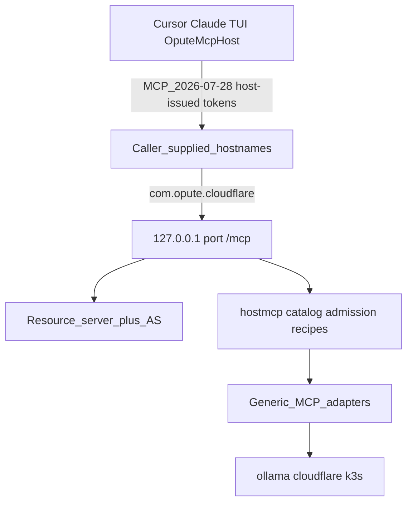

# Final plan: product-neutral Host Agent MCP

## Verdict on the proposed plan

The proposed shape is **correct** and is the architecture already written in [ADR 0001](docs/adr/0001-standalone-mcp-mvp.md), [ADR 0002](docs/adr/0002-provider-extension-architecture.md) (I-25), [ADR 0003](docs/adr/0003-cloudflare-provider-incus-containers.md), [ADR 0006](docs/adr/0006-canonical-host-agent-identity.md), and [2026-08-22-generic-tunneling-recipes-plan.md](2026-08-22-generic-tunneling-recipes-plan.md). Production reverse-tunnel is the documented exception. This work deletes that exception so the tree matches the design.

Motivations 1–8 stand. The invariant table is the right capture format. Workstream order (records → A → B → C → D → E) is the only safe sequence. Dual-era MCP is not a completion leftover.

The review changes the plan in eight places. Those are incorporated below; they are not optional polish.

## What the review changed

**1. There are three phone-homes, not one WSS.** Reverse-tunnel mode in `[internal/app/app.go](internal/app/app.go)` currently:

- skips Streamable HTTP `/mcp` and serves health-only
- dials MCP-over-WSS to `{OPUTE_HOST_WS_URL}/mcp-agent/{id}` (`[internal/transport/reverse_tunnel.go](internal/transport/reverse_tunnel.go)`)
- dials a **non-MCP** Host Worker Protocol WSS to `{base}/host/v1/connect` (`[internal/transport/host_worker.go](internal/transport/host_worker.go)`) that dispatches `sync_call` / `assign` / `stream_open` into `DispatchTool`
- as a separate path, platform mode is an outbound MCP **client** calling `register_host_agent` / `host_agent_heartbeat` at `OPUTE_MCP_URL` (`[internal/heartbeat/service.go](internal/heartbeat/service.go)`)

T-1 evidence must be: no reverse-tunnel loop, **no HWP worker**, no CPC heartbeat client, process always serves `/mcp`.

**2. Do not delete WSS in workstream A.** Production dogfood (`opute-host-agent.service` + `wss://mcp.opute.io`) still depends on the tunnel. A makes loopback `/mcp` **always on** even when reverse-tunnel is enabled. WSS/HWP/heartbeat stay until C has a proven HTTPS `tools/call` (e.g. `list_vms`). Dual-run is a migration exception with expiry: C completion.

**3. A-3 decides the Opute product path.** `opsess_`* / `opha_`* / CPC tokens must never open host `/mcp`. Therefore:

- Cursor / Claude / TUI talk to the **host resource URL** with **host-issued** tokens.
- Opute MCP Host, if it still federates host tools for chat/UI, is a **confidential HTTP MCP client** of the enrolled host URL, using a host-audience token minted for that client. It is not a WSS server waiting for phone-home, and it does not pass through user sessions.

**4. `tunneling.v1` is not greenfield.** The Cloudflare plugin already exposes `opute.capability.tunneling.ensure-host-tunnel` / `probe-host-tunnel` / `remove-host-tunnel` plus legacy aliases. B is: `hostnames[]` (schema today is singular `hostname`), any-zone strings, approved `localTarget` / `host-agent-mcp` binding, activation = authenticated public `tools/list` (I-14 / `http-exposure.v1`), core never spawns `cloudflared`.

**5. Standalone currently forbids `MCP_AUTH_TOKEN`.** `[internal/config/config.go](internal/config/config.go)` treats it as a platform setting. That contradicts A-6 (bootstrap admin token). Standalone must reject CPC/WSS/onboarding vars only.

**6. Heartbeat carries Opute inventory, not just liveness.** Capacity, `metadata.publicIp`, and `endpoint: tunnel://mcp-host` ride registration. C must replace that with enroll-URL + pull `/health` (and a typed status/capacity observation if the UI still needs VM counts). Deleting heartbeat without a pull model blanks Infrastructure.

**7. The 2026-07-28 spec is stricter than the original A2 sketch.** CIMD replaces DCR as the new-client path; each canonical MCP URL is its own RFC 8707 resource; Origin, `HeaderMismatch`, GET/DELETE 405, and RFC 9207 `iss` are required. See [MCP 2026-07-28 spec compliance](#mcp-2026-07-28-spec-compliance).

**8. Completion is modern-only, not dual-era.** First-party canaries, the Go SDK provider adapter, release smoke, npm tests, and ADR 0001 still teach `initialize` / `Mcp-Session-Id` / `2024-11-05`. Workstream E deletes that era. `server/discover` must not advertise `resources.listChanged` without `subscriptions/listen`. Cursor still using `initialize` is unverified, not a waiver.

## Invariant delta (step 0, same change as the first ADR)

Capture via sibling `permanent-agentic-invariants` before implementation. Owner artifacts: new Host Agent **ADR 0008** (product-neutral kernel transport + in-process AS), updates to ADR 0001 (standalone may have a host bootstrap token), ADR 0006 (identity is not transported by heartbeat), Opute decision retiring reverse-tunnel / CPC phone-home, and `.agents/decisions/permanent-agentic-invariants.json` plus verifiers.

Use the proposed T/P/A/I/L table as the ADR body. Record each as **preserve / strengthen / introduce / retire**:

- **Preserve:** C-01, I-04, I-18, I-25, C-08, I-05/C-03 one `plan.Runner`, ADR 0006 opaque `OPUTE_REMOTE_AGENT_ID`, I-22 redaction, two-phase teardown (ADR 0003), `/health` unauthenticated.
- **Strengthen:** I-25 (boot test with no tunnel provider); architecture test: no Cloudflare lifecycle in `internal/ops` dispatch; no product hostnames in `internal/` runtime (fixtures/docs may still mention `opute.io` as example data).
- **Introduce:** T-1 through T-5, P-1 through P-4, A-1 through A-7, I-cli, I-dns, L-2/L-3 as written. Add **T-6**: HWP is not a client transport; retiring reverse-tunnel without retiring HWP is incomplete. Add **C-enroll**: Opute discovers a host by an enrolled resource URL plus `OPUTE_REMOTE_AGENT_ID`; the agent does not register itself. Add **S-1–S-8** from the spec-compliance section (stateless POST, Origin, HeaderMismatch, CIMD-not-DCR, per-URL audience, RFC 9207 `iss`, modern-only reject, honest `server/discover`).
- **Retire:** `OPUTE_REVERSE_TUNNEL` health-only fork; `endpoint: tunnel://mcp-host`; Go CPC heartbeat; install-script WSS block; watchdog that treats `agents.active` on `mcp.opute.io` as host liveness; `MCP_AUTH_TOKEN` forbidden in standalone.

Exception path: dual-run WSS+loopback `/mcp` until C evidence exists. No silent permanent exception.

## MCP 2026-07-28 spec compliance

Authority: [blog 2026-07-28](https://blog.modelcontextprotocol.io/posts/2026-07-28/), [Authorization](https://modelcontextprotocol.io/specification/2026-07-28/basic/authorization), [Client registration](https://modelcontextprotocol.io/specification/2026-07-28/basic/authorization/client-registration), [Security considerations](https://modelcontextprotocol.io/specification/2026-07-28/basic/authorization/security-considerations), [Streamable HTTP](https://modelcontextprotocol.io/specification/2026-07-28/basic/transports/streamable-http), [Versioning](https://modelcontextprotocol.io/specification/2026-07-28/basic/versioning), `[server/discover](https://modelcontextprotocol.io/specification/2026-07-28/server/discover)`.

The previous A2 draft was **not** spec-complete: it treated DCR as the enrollment path, left loopback vs public audience ambiguous, omitted Origin / `HeaderMismatch` / GET-405, and did not emit RFC 9207 `iss`. Those are corrected here. First-party Host Agent is a **modern-only** server (`2026-07-28`). Dual-era `initialize` is a spec **MAY**, not the default.

### Transport (MUST)

- Single MCP endpoint; every JSON-RPC message is **POST**. **GET/DELETE → 405**. Ignore `Mcp-Session-Id` and `Last-Event-ID`; do not mint sessions. HTTP+SSE is deprecated; do not add a GET stream.
- Every POST carries `MCP-Protocol-Version`, `Mcp-Method`, and `Mcp-Name` where required. Header values **MUST** match the body or the server returns **400** + JSON-RPC `-32020` `HeaderMismatch` (decode `=?base64?...?=` before compare). Version header **MUST** match `params._meta.io.modelcontextprotocol/protocolVersion`.
- Unknown method → **404** + `-32601`. Unsupported version → **400** + `-32022` `UnsupportedProtocolVersionError` with `supported: ["2026-07-28"]`.
- `server/discover` is **MUST** on the server, **optional** for clients. First-party canaries use it; they do not require it before `tools/call`.
- **Origin**: if present and not on the allowlist (loopback origins for `127.0.0.1`; the request Host for public names), **403**. Bind loopback by default (spec SHOULD; our T-4 MUST).
- Cancellation = close the request SSE stream (not `notifications/cancelled`). Optional `X-Accel-Buffering: no` on SSE. No `Last-Event-ID` resume.
- Tasks remain the `io.modelcontextprotocol/tasks` **extension**. Do not adopt deprecated Sampling, Roots, or Logging. Do not adopt Enterprise Managed Authorization (EMA); that is an optional extension and would point identity at a product IdP (violates A-7).
- `tools/list` (and other list RPCs) SHOULD include `ttlMs` / `cacheScope`.

### Authorization (MUST / SHOULD)

Authorization is optional for MCP in general; **when we protect `/mcp` we MUST implement this profile**.

- Host Agent is an OAuth 2.1 **resource server**. Co-located AS is allowed.
- **RFC 9728 PRM** at `/.well-known/oauth-protected-resource` (path insertion when the resource URL has a path, e.g. `/mcp`). 401 `WWW-Authenticate: Bearer resource_metadata="…", scope="…"`.
- AS **MUST** advertise RFC 8414 metadata (OIDC discovery MAY). Include `code_challenge_methods_supported: ["S256"]` (clients MUST refuse if absent), `authorization_response_iss_parameter_supported: true`, and `client_id_metadata_document_supported: true`.
- **CIMD is the new-client path** (spec SHOULD; DCR is deprecated and MAY only as fallback). AS fetches HTTPS `client_id` URLs, validates `client_id` matches URL, validates `redirect_uris`, caches per HTTP cache headers, SSRF-blocks link-local/metadata. Native redirects `http://127.0.0.1` / `http://localhost` are allowed. Display hostname on consent. If DCR is kept for an old client, require `application_type: native` for desktop/CLI; do not design around DCR.
- Client registration priority we honor as AS: pre-registered (bootstrap admin, Opute confidential client) → CIMD → optional DCR → fail closed.
- PKCE **S256** required. Short-lived access tokens. Public clients: rotate refresh tokens (OAuth 2.1). PRM / 401 `scope` **MUST NOT** include `offline_access`.
- **RFC 9207**: authorization responses include `iss`; clients (Opute, tests) validate before token redeem. We emit `iss` now (spec SHOULD, future MUST).
- **RFC 8707**: `resource` on authorize and token requests. Audience is the **canonical URI of the MCP endpoint the client actually called** (`http://127.0.0.1:3014/mcp` ≠ `https://agent.example.com/mcp`). RS rejects tokens whose audience is not this request’s canonical URI. Tokens MUST NOT appear in query strings. 401 invalid/expired; 403 `insufficient_scope` with `WWW-Authenticate`.
- **Token passthrough is forbidden**: accept only tokens this AS minted for this resource. Reject `opsess_`*, `opha_`*, `opit_*`, CPC, and any token minted for `mcp.opute.io` (A-3). If this process calls provider MCP, it uses a **separate** token; never forward the client’s host token (confused-deputy).
- **HTTPS**: public MCP + AS + PRM MUST be HTTPS (Cloudflare satisfies this). Loopback AS over `http://127.0.0.1` is Origin-locked local-only; public clients OAuth against the HTTPS resource URL after the first tunnel binding. Redirect URIs: localhost or HTTPS only.
- RFC 7009 revoke remains (A-4); not a 2026-07-28 MUST, but required by our “kick a client” story.

Spec invariants to record in ADR 0008:

- **S-1** Stateless POST `/mcp` only; GET/DELETE 405; never mint or require `Mcp-Session-Id`.
- **S-2** Origin allowlist; invalid Origin → 403.
- **S-3** `MCP-Protocol-Version` + `Mcp-Method` + `Mcp-Name` match body or `HeaderMismatch` `-32020`.
- **S-4** CIMD + pre-registration only. Do not implement DCR (deprecated).
- **S-5** RFC 8707 audience is the request’s canonical MCP URI; no token passthrough.
- **S-6** RFC 9207 `iss` on authorize responses; PKCE S256 advertised in AS metadata.
- **S-7** Modern-only: `supportedVersions` is exactly `["2026-07-28"]`. `initialize`, `notifications/initialized`, `2024-11-05`, `2025-03-26`, and `2025-11-25` are rejected, not served.
- **S-8** `server/discover` advertises only capabilities this process implements. No Sampling, Roots, Logging, HTTP+SSE, or `listChanged` without `subscriptions/listen`.

### What we explicitly will not do

- Dual-era server (serve `initialize` “for Cursor”). Completion is modern-only. A legacy editor that cannot speak `2026-07-28` is unverified, not a reason to keep the handshake. `initialize` errors MUST name `supported: ["2026-07-28"]` (`UnsupportedProtocolVersionError` / unknown method) so legacy clients can surface a useful diagnostic.
- Custom WSS as an MCP transport. Spec allows custom bindings that preserve JSON-RPC + per-request `_meta`; production reverse-tunnel does not meet that bar and is retired in C2, not rebranded.
- Pointing PRM `authorization_servers` at Opute, using EMA, or implementing DCR/Sampling/Roots/Logging “for compatibility.”

## Workstreams

### 0 — Records (Host Agent + Opute)

Write ADR 0008 and the Opute reverse-tunnel retirement decision. Run `bun run decisions:for-path` on `internal/transport`, `internal/app`, `internal/heartbeat`, `packages/mcp-host`, `packages/server/src/host-agent-install-scripts.ts`. Update skill indexes only with links (cordis-go, host-agent-boundaries, opute host-agent). Do not implement yet.

### A — Always-on kernel HTTP MCP + in-process AS (this repo)

**A1 — kill the health-only fork, keep WSS temporarily**

- Always construct `[transport.NewHTTPServer](internal/transport/http.go)` on `HOST_MCP_BIND_HOST:HOST_MCP_PORT` (default `127.0.0.1`).
- Reverse-tunnel, if still enabled, is extra ingress only. Delete `[health_only.go](internal/transport/health_only.go)` usage.
- Bind validation: reject implicit `0.0.0.0`; T-4.
- Spec transport on `/mcp`: Origin allowlist; POST only; GET/DELETE **405**; no session IDs; `Mcp-Method`/`Mcp-Name`/`MCP-Protocol-Version` validated against body (`HeaderMismatch` `-32020`); missing Origin-invalid → 403.
- `/health` open; `/mcp` never open when tokens/AS exist (today `authorize` returns true if `len(tokens)==0` — fail closed once A2 lands, or require bootstrap token in non-dev).

**A2 — resource server + co-located AS in this process**

New package (e.g. `internal/authz`), SQLite-backed grants beside existing state. MCP 2026-07-28 OAuth profile, not a generic IdP and not EMA:

- RFC 9728 PRM (`authorization_servers` = **this** AS). Host-aware canonical resource URI. 401 `WWW-Authenticate` with `resource_metadata` + `scope`.
- RFC 8414 metadata: PKCE `S256`, `iss` on authorize responses (RFC 9207), `client_id_metadata_document_supported`.
- **CIMD** for Cursor/Claude (HTTPS `client_id`, SSRF-safe fetch). Pre-register Opute as a confidential client. **Do not implement DCR.**
- RFC 8707: audience = the canonical URL of **this request** (loopback token fails on public hostname and the reverse). Tests must cover two URLs.
- RFC 7009 revoke; next `tools/list` fails (A-4).
- Bootstrap env token is first admin only (A-6); used to mint/revoke pre-registered clients, then optional retire.
- `authorize()` rejects `opha_*`, `opit_*`, `opsess_*`, CPC bearer (A-3). Negative tests. Never forward host tokens to provider MCP.

Do not introspect tokens at Platform. Do not mint tokens for `mcp.opute.io`.

**A3 — local Cursor**

Loopback `http://127.0.0.1:3014/mcp` (standalone) / `:3004` (platform) with bootstrap admin token or CIMD/PKCE against the loopback resource URI. First-party canary is **modern-only**: `MCP-Protocol-Version: 2026-07-28`, `_meta`, optional `server/discover`, no `initialize`, no `Mcp-Session-Id`. Fix standalone isolation: allow host bootstrap token; still trap CPC URLs/WSS. If Cursor/Claude still send `initialize`, record that as unverified client evidence — do not add dual-era to make the canary green.

### B — `tunneling.v1` multi-binding (this repo + Cloudflare plugin)

- Contract: `hostnames[]` opaque strings, any zones, N names. No `*.opute.io` special case (P-2). Tests with two fake zones.
- `localTarget` is not authority; approved `host-agent-mcp` binding to this process’s `/mcp` only (generic tunneling plan).
- Cloudflare plugin implements `cloudflared` / API. Core dispatch default-unknown for vendor names (P-1).
- Activation evidence: public HTTPS route **and** authenticated `tools/list` (P-4). HTTP 200 is not ready.
- Chicken-egg: first public name configured **via loopback MCP**.
- Negative: Cloudflare down, local `/mcp` still serves (P-3 / I-25).

### C — Opute becomes a client; then delete phone-home (sibling first)

**C1 — HTTP downstream (Opute), WSS still up**

- Enroll `{agentId, resourceUrl}` instead of waiting for `register_host_agent`. Opute is a **pre-registered confidential MCP client** of the host AS (CIMD URL or static `client_id` bound to this issuer). It obtains a host-audience token; it never sends `opsess_`*.
- MCP Host / `BridgeHostDispatcher` call the enrolled URL with Streamable HTTP **2026-07-28** headers (`MCP-Protocol-Version`, `Mcp-Method`, `Mcp-Name`, `_meta`) + that host token. `list_vms` over HTTPS MCP is the canary (I-cli).
- DNS only for zones Opute actually operates (I-dns). Stale DNS, CF 524, token rotation are client-registry problems.
- Replace heartbeat-fed capacity/`publicIp` with pull of `/health` plus a typed host status observation if the UI still needs it.
- Watchdog probes the **host** URL, not `mcp.opute.io` `agents.active`.

**C2 — delete phone-home (both repos, one change)**

- Go: remove `RunReverseTunnelLoop`, `RunHostWorkerLoop`, `internal/heartbeat` CPC client, `OPUTE_REVERSE_TUNNEL`, `OPUTE_HOST_WS_URL`, `OPUTE_MCP_URL` as required-to-serve, `tunnel://mcp-host`.
- Opute: stop writing those vars in `[host-agent-install-scripts.ts](../opute/packages/server/src/host-agent-install-scripts.ts)`; delete `/mcp-agent/*` upgrade path after no production agent uses it; rewrite host-agent skill (today it still documents WSS as the production path).
- Load `shared-runtime-leases` before touching the shared WSL `opute-host-agent.service`.

C2 is forbidden until C1 has production-shaped evidence. Unrun live CF/Cursor = unverified, not pass.

### D — Tree matches the ADRs (this repo)

- Remove vendor names from core catalog/standalone (`ensure_cloudflared_tunnel` in `[internal/tools/standalone.go](internal/tools/standalone.go)` / `[schemas/standalone-tools.json](schemas/standalone-tools.json)` with no dispatch). Plugin aliases then delete (`retired-capability-name-removal`).
- Architecture tests: no Cloudflare in core; no `opute.io` / `mcp.opute.io` in `internal/` runtime; no websocket dialer in `internal/transport` except tests.
- Skill/AGENTS links to ADR 0008 only; no second policy copy.

### E — Modern-only MCP era (complete cleanup)

Completion means this process, its first-party clients, tests, schemas, and docs speak **only** `2026-07-28`. Dual-era is not a leftover compatibility mode. The [deprecated registry](https://modelcontextprotocol.io/specification/2026-07-28/deprecated) plus retired handshake/session/GET-stream are the kill list.

**Server (reject, do not serve)**

- `initialize` / `notifications/initialized` → unknown method or `UnsupportedProtocolVersionError` with `supported: ["2026-07-28"]`. Never start a session.
- `MCP-Protocol-Version` or `_meta` of `2024-11-05`, `2025-03-26`, `2025-11-25` → 400 `-32022`.
- GET or DELETE `/mcp` → **405**. Ignore `Mcp-Session-Id` and `Last-Event-ID`; never echo a session id.
- `OPUTE_TRANSPORT=stdio` already fails; keep the guard. Do not add HTTP+SSE.
- Sampling, Roots, Logging, DCR: not implemented and not advertised.
- `server/discover` today advertises `resources.listChanged: true` with no `subscriptions/listen`. Either implement listen (2026 replacement for GET-stream list changes) or drop `listChanged` / `resources` from capabilities. Advertise only what works: `tools` + `io.modelcontextprotocol/tasks`.
- List RPCs that we keep SHOULD return `ttlMs` / `cacheScope`.
- `[internal/cordis/mcp/adapter.go](internal/cordis/mcp/adapter.go)` must not treat Go SDK `InitializeResult()` as the handshake. Provider connect uses `server/discover` + `tools/list` with 2026 headers; require `2026-07-28`. Provider MCPs (Cloudflare, Ollama, K3s) are modern-only the same way — no `initialize` in plugin tests.

**First-party clients, tests, schemas (rewrite, then delete leftovers)**

- `[scripts/verify-release-install.sh](scripts/verify-release-install.sh)` — currently `initialize` + `2024-11-05` + requires `mcp-session-id`. Replace with `server/discover` or direct `tools/list` + 2026 headers; assert **no** `Mcp-Session-Id`.
- `[npm/local-host-agent/published-canary.test.js](npm/local-host-agent/published-canary.test.js)` — same; drop session store.
- `[schemas/streamable-http-client.json](schemas/streamable-http-client.json)` — remove `sessionHeader`. Fixture must not mention `Mcp-Session-Id`.
- `[README.md](README.md)`, `[npm/local-host-agent/README.md](npm/local-host-agent/README.md)`, [ADR 0001](docs/adr/0001-standalone-mcp-mvp.md) first-run: `server/discover` → `tools/list` → read-only tools. Not `initialize`.
- [ADR 0003](docs/adr/0003-cloudflare-provider-incus-containers.md) validation notes and [cordis-development-guide.md](docs/cordis-development-guide.md) dual-era `initialize` language: present-tense modern-only.
- `[tmp/standalone_mcp_e2e.go](tmp/standalone_mcp_e2e.go)`, `[tmp/standalone_cleanup.go](tmp/standalone_cleanup.go)`, `[tmp/tier5-ide-canary.sh](tmp/tier5-ide-canary.sh)`, `[tmp/launcher-canary.sh](tmp/launcher-canary.sh)` — rewrite or delete; they still handshake `2025-11-25` / `initialize`.
- Sibling Opute: `scripts/validate-go-host-agent-phase1.ts` step `mcp_initialize` becomes connect-without-handshake; `create-mcp-client` checklist still documents 2025-11-25 `initialize` as a second era — first-party Host Agent paths must not follow it.

**Guardrail tests (falsify S-7 / S-8)**

Wire tests in `test/compliance`:

- POST `initialize` → not a successful `InitializeResult`; no `Mcp-Session-Id` on any response.
- POST with `MCP-Protocol-Version: 2025-11-25` → `-32022`.
- GET `/mcp` and DELETE `/mcp` → 405.
- `server/discover` `supportedVersions` equals `["2026-07-28"]` only; capabilities omit Sampling/Roots/Logging and any `listChanged` we do not implement.
- Static/architecture: no `sessionHeader` in shipped schemas; no first-party canary string `method":"initialize"` except the negative test.

**Completion gate:** `MCP_ERA_2026_07_28_PASS` — the negative suite plus rewritten release/npm canaries. A green unit test that still documents `initialize` as first-run is not a pass. Live Cursor/Claude that still handshake = unverified clients, not a dual-era waiver.

## Validation

Static: `gofmt`, `go vet`, `go test ./...`, architecture/catalog tests, `decisions:for-path`, schema export if `hostnames[]` lands.

Loopback: Origin 403 on bad Origin; GET `/mcp` → 405; POST `initialize` fails with no session header; `2025-11-25` → `-32022`; missing `Mcp-Method` → `HeaderMismatch`; 401 + PRM; CIMD or bootstrap token `tools/list`; loopback-audience token rejected on a second resource URI; revoke; `opha_*`/`opsess_*` rejected; MCP up with **no** tunnel provider.

Tunnel: two hostnames / two domains; authenticated public `tools/list`; remove binding; leftovers gone (`incus list` if guests used). Live CF unverified ≠ pass.

Clients: Cursor + Claude on a public name; Opute one real `tools/call` over **HTTPS MCP, not WSS**.

Negative: Cloudflare down, local MCP still works. Dual-run removed only after that matrix.

## Order and punchline

1. Invariant/ADR/decision records.
2. A1 always-on `/mcp` (WSS still exists).
3. A2/A3 in-process AS; local modern-only canary.
4. B multi-hostname tunneling.v1.
5. C1 Opute HTTP client + enroll/pull.
6. C2 delete WSS, HWP, heartbeat.
7. D leftovers; mark reverse-tunnel retired.
8. E modern-only era cleanup + `MCP_ERA_2026_07_28_PASS`.

Punchline stays: neutrality, one kernel, spec auth at `/mcp`, tunneling as a capability. The review adds: retire **all three** phone-homes, dual-run until Opute is a client, CIMD+per-URL audience, and a **complete** legacy-MCP kill so the finished tree is modern-only `2026-07-28` — not dual-era with a green canary.