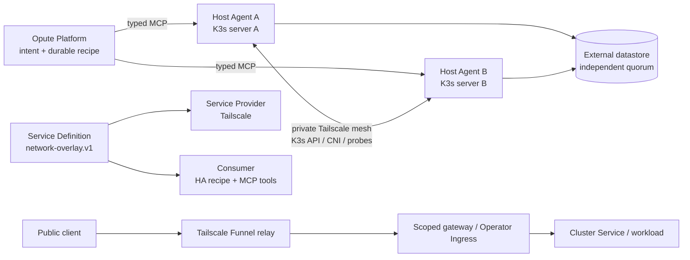

# Design: Tailscale private mesh and Funnel ingress

## Context

The Host Agent is the product-neutral executor. Its Go Cordis kernel owns typed
service composition, dependency resolution, provider generations, effects,
events, drain, and disposal. MCP is an edge transport adapter. Opute owns
intent, authorization, durable orchestration, routing, and semantic outcomes.

The repository already has a Cloudflare tunneling provider under
`plugins/tunneling/cloudflare/`; no Tailscale provider is present. This change
must therefore add a replaceable provider, not a Tailscale-specific route in
the Host Agent core.

The target topology has two K3s servers on independently addressed hosts. The
Tailscale mesh is the private transport between them. Funnel is an explicitly
public application-ingress path. It is not a replacement for the private mesh,
the Kubernetes datastore, or authenticated Host Agent MCP administration.

The portable interactive visualization is
[visuals/tailscale-two-node-ha.html](visuals/tailscale-two-node-ha.html).

## Goals

- Define one provider-neutral overlay and public-ingress seam that Cloudflare
  and Tailscale can both implement.
- Keep Tailscale node enrollment, tags, grants, mesh state, Serve, Funnel, and
  cleanup provider-owned.
- Make every cross-host mutation target an exact opaque Host Agent identity.
- Make the K3s datastore mode explicit before claiming two-node availability.
- Preserve a safe distinction between private transport, public ingress, and
  management control paths.
- Produce wire, lifecycle, cleanup, durable-evidence, and live failure proof.

## Non-goals

- Replacing Cloudflare or changing its existing provider contract.
- Treating a node's Tailscale IP, hostname, or display label as Host Agent
  identity or as the canonical cluster identity.
- Routing etcd, Kubernetes API, CNI, or Host Agent administration through
  Funnel.
- Calling `tailscale`, `kubectl`, K3s, or provider APIs directly from Opute or a
  driver script.
- Claiming two embedded-etcd voting members provide automatic Kubernetes write
  availability after one member fails.

## Decision 1 — Three-role capability seam

The capability is split into the roles required by the DeepSeek Harness
three-role pattern:

### Service Definition

The Host Agent contract defines a stable service key and versioned request and
result types for:

- `validate` — provider prerequisites, target identities, policy, and
  credential-kind validation;
- `enroll` / `remove` — target-bound node membership;
- `ensure-private-mesh` — peer reachability and route readiness;
- `ensure-private-service` — tailnet-only Serve exposure;
- `ensure-public-ingress` — scoped Funnel exposure of a local gateway or
  operator-managed Kubernetes Ingress;
- `probe` — typed readiness and path separation; and
- `teardown` — ownership-proven cleanup.

The definition owns `Requires` and `Produces` bindings, resource kinds,
write-only secret fields, task support, and observation schemas. It does not
mention Tailscale commands, Cloudflare objects, provider URLs, or provider
credential formats.

### Service Provider

The Tailscale provider implements the definition and owns:

- node enrollment and node/tag identity;
- tailnet policy and grant prerequisites;
- private peer and route convergence;
- local Serve and Funnel lifecycle;
- provider-specific retries, readiness checks, and cleanup; and
- provider-specific redaction before observations cross the MCP boundary.

The provider depends on the Service Definition only. It does not import Opute
recipe semantics or the consumer's tool names.

### Consumer

The Kubernetes HA recipe and public-ingress consumer depend on the definition
only. They select exact Host Agent IDs, provide explicit target URIs and
declared bindings, and interpret typed results. They do not call Tailscale,
Cloudflare, or K3s directly.

Provider replacement follows the existing candidate → ready → active →
draining lifecycle. A failed manifest, readiness probe, catalog publication,
or cleanup step does not expose a partial provider generation.

## Decision 2 — Private mesh is the only cross-node data-plane path

Each selected K3s server is enrolled as a Tailscale node. The provider returns
an opaque overlay resource URI and observed transport facts, such as the
Tailscale address and peer status, only in the typed execution result. Those
addresses are transport coordinates; they are never Host Agent identity,
cluster identity, or a durable display alias.

The recipe must prove, before K3s join completion:

1. A and B are the exact requested Host Agents.
2. Both intended guests are the exact requested VM/container resources.
3. Each node is enrolled in the intended tailnet with the intended tag/grant
   policy.
4. Required K3s paths traverse the private mesh: API, server-to-server
   control-plane traffic, CNI traffic, and health probes.
5. Public Funnel is not being used for any private path.

The provider must fail closed on an unapproved route, unexpected peer,
ambiguous target, stale generation, or cross-cluster pod CIDR collision. It must
not infer a route from a display name or from whichever peer happens to be
first in a status listing.

K3s's Tailscale integration is experimental. The implementation must record
the selected K3s version and the exact integration mode as evidence, and must
not silently fall back to embedded etcd when the deployment is distributed
over the mesh.

## Decision 3 — Two servers have an explicit datastore and availability mode

The deployment input must select one of these modes:

| Mode | Claim allowed | Required evidence |
| --- | --- | --- |
| `external-datastore` | Two control-plane servers can preserve Kubernetes API writes across one server loss, subject to datastore availability | Independent datastore endpoint, TLS/auth readiness, failover or quorum evidence, and two server observations |
| `embedded-etcd-two-node` | Served-surface continuity only; Kubernetes writes require acknowledged recovery after a member loss | Two members, explicit non-HA status, failure-injection result, and typed quorum-recovery evidence |

The default for a claim named “two-node HA” is `external-datastore`, but the
external datastore itself must be independently highly available. A single
PostgreSQL or etcd process on one of the two hosts merely moves the single
point of failure and does not satisfy the claim.

The readiness result therefore includes `datastoreMode`, `availabilityClass`,
and `recoveryPolicy`. A result with two ready servers and embedded two-member
etcd cannot be projected as generic `ha=true`.

The Host Agent does not invent a recovery action. If the selected mode needs
single-member recovery, Opute owns the explicit acknowledgement and durable
recipe; the Host Agent executes only the admitted typed recovery assignment.

## Decision 4 — Funnel is scoped public ingress, not failover by itself

Funnel is configured only for a local gateway or a Tailscale Kubernetes
Operator Ingress that targets an application Service. The provider must reject
targets that are:

- a remote URL rather than a local resource;
- an etcd, Kubernetes API, CNI, or Host Agent administrative endpoint;
- outside the caller's declared resource binding; or
- missing application-level authentication when the service is sensitive.

Tailnet-only administration uses Tailscale Serve, not Funnel.

The implementation must represent public endpoint stability explicitly:

- A host-level Funnel URL is node-specific. Active/standby promotion to B is a
  typed change of endpoint and is not claimed to preserve a stable public URL.
- For a stable application endpoint, prefer a Tailscale Kubernetes Operator
  Ingress with `tailscale.com/funnel: "true"`, proxy replicas on both servers,
  and a Kubernetes Service. The provider still records the exact generated
  Tailscale service identity and readiness evidence.
- If the operator or endpoint cannot prove the requested stability, the result
  is `stable=false` and the consumer must not store it as the cluster's
  host-independent API endpoint.

Funnel policy requires explicit tailnet authorization for the selected nodes or
operator proxies. The public path remains TLS-terminated at the node/operator
boundary and must be followed by the service's own authentication and
authorization.

## Decision 5 — Credentials are transient typed inputs

The Platform may authorize a provider credential reference, but secret values
are supplied only through the write-only typed execution binding needed for the
operation. The provider must validate credential kind before use:

- a Tailscale API credential is not silently treated as a node auth key;
- a node auth key is scoped to the target tailnet, tags, expiry, and operation;
- provider results, task context, durable state, traces, logs, prompts, and
  evidence contain only schema-redacted projections; and
- teardown uses recorded ownership metadata and never guesses a service, node,
  route, or credential path.

An unknown durable projection fails closed. The provider must not add a
key-name-based redaction heuristic as a substitute for the owning schema.

## Decision 6 — Evidence and revision boundaries

The change is not complete when a local Tailscale command succeeds. The
implementation must produce evidence at the boundary where each invariant can
fail:

- provider manifest and catalog revision;
- authenticated Streamable HTTP MCP `server/discover`, `tools/list`, and
  `tools/call` traces;
- exact Host Agent, VM/container, cluster, node, overlay, and ingress resource
  identities;
- private-mesh path probes and negative proof that Funnel was not used for
  private traffic;
- public Funnel readiness from outside the tailnet, with `stable` status;
- datastore mode and two-node failure-injection results;
- provider generation activation, drain, cancellation, and cleanup; and
- absence of credentials and raw provider output from durable evidence.

Changes to the Service Definition, schemas, `Requires`/`Produces` edges,
credential kind, provider generation, or endpoint stability must advance the
relevant capability/catalog/evidence fingerprint. A provider replacement cannot
reuse a stale generation or stale public endpoint binding.

## Invariant delta

| Field | New durable rule |
| --- | --- |
| Statement | Private cluster traffic uses an admitted provider-neutral overlay; public Funnel traffic is scoped to an application ingress; two-node datastore mode controls the availability claim. |
| Owner | Host Agent capability/schema and provider lifecycle, with Opute recipe and routing consumers. |
| Authority | This change's delta specs, the Host Agent Cordis development guide, and the eventual typed decision record/ADR before implementation. |
| Rationale | Prevents provider-specific routing, public exposure of private control paths, split-brain claims, and credential leakage. |
| Scope | Provider discovery, enrollment, mesh readiness, K3s join, public ingress, failover/promotion, teardown, and durable evidence. |
| Exception | Cloudflare may implement the same neutral contract; any provider-specific exception requires a superseding typed decision. |
| Evidence | Separate-process MCP tests, schema/redaction tests, lifecycle cleanup tests, private/public path probes, and per-node failure injection. |
| Revision behavior | Contract/schema, binding, provider generation, endpoint, and evidence fingerprints advance when any authoritative input changes. |

## References

- [DeepSeek Harness: Three-role capability design](https://deepseek-harness.github.io/deepseek-harness/en/develop/practice/)
- [K3s architecture](https://docs.k3s.io/architecture)
- [K3s embedded etcd HA](https://docs.k3s.io/datastore/ha-embedded)
- [K3s distributed networking and Tailscale integration](https://docs.k3s.io/networking/distributed-multicloud)
- [Tailscale Funnel](https://tailscale.com/docs/features/tailscale-funnel)
- [Tailscale Kubernetes Operator Funnel ingress](https://tailscale.com/docs/kubernetes-operator/ingress/expose-workload-to-internet)
