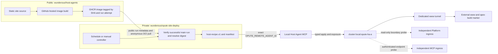

# Design: Private site deployment controller

## Context

The site is static. The public source repository can build its OCI image on a
GitHub-hosted runner without access to the local Host Agent. The local Host
Agent exposes authenticated Streamable HTTP MCP on port 3004 and uses an opaque
process identity. The deployment machine is also the WSL machine serving the
site through a two-server K3s cluster and a dedicated public tunnel.

The deployment controller must reach that local MCP endpoint while keeping
public pull request code away from the Host Agent process environment.

## Ownership flow

## Decision 1: Public GitHub-hosted image production

The source workflow runs only on GitHub-hosted runners. It writes a public,
non-secret build marker into the Nginx document root and pushes the image to
GHCR. Human-readable tags include the full source SHA and unique run/attempt;
the deployment controller resolves the run tag to a sha256 digest. The
attestation subjects that digest.

The deployment controller does not clone or execute the public source
repository. It trusts only GitHub workflow-run metadata for the exact workflow
path, main branch, allowed event, successful conclusion, and source SHA, then
derives the unique OCI tag from the returned run ID and attempt. Provenance
verification requires the certificate's source commit, run/attempt invocation
URI, and hosted-runner claim to match the selected run before recipe execution.

## Decision 2: Polling avoids a cross-repository credential

The private workflow polls every five minutes. This creates a bounded delay
compared with a GitHub App dispatch, but needs no long-lived cross-repository
secret. An optional manual source run ID supports immediate execution and
rollback, and is checked against the same successful-main-run rules.

A schedule must not deploy while the newest source run is queued, in progress,
or failed. It must not silently deploy a prior successful run. An explicit
manual selection may choose an older successful main run.

## Decision 3: Private runner owns local Host Agent access

The Linux x64 self-hosted runner is registered to the private deployment
repository only. It runs as the same Unix user as the Host Agent so it can
read the protected process environment and local recipe path. No Host Agent
token or host identity is stored in repository variables, secrets, logs, or
artifacts. Workflow token permissions are read-only.

The deployment workflow has only scheduled and manual triggers on the private
repository default branch. A separate read-only validation workflow runs
private pull-request checks on GitHub-hosted runners. The runner is never
registered to the public source repository.

## Decision 4: The recipe remains the mutation authority

The private controller verifies source metadata and prepares typed inputs. It
calls fresh tools/list, confirms the exact Host Agent identity and canonical
cluster URI, hashes and validates the checked-in host-local recipe at
`site/recipes/www-opute-io.yaml`, runs that recipe, and polls
get_host_plan_run until terminal. The recipe consumes the image digest; it does
not build or push an image.

The recipe applies the namespaced workload, checks Pod readiness, ensures the
existing dedicated tunnel, probes www and apex, and leaves the Platform
namespace and tunnel outside its mutation scope. The controller performs
read-only post-deploy checks against the exact Deployment image and external
build marker.

## Decision 5: Every eligible deployment reconciles through the recipe

After source provenance and recipe validation, every eligible scheduled or
manual controller run executes the checked-in Host Agent recipe, including
when the selected digest is already deployed and Ready. Each controller run
uses a unique deployment nonce in the recipe idempotency key. The recipe
reapplies the desired workload, ensures the dedicated tunnel, and probes both
public routes, so repeated polling also reconciles exposure and serving state.
An unreadable or ambiguous Host Agent result fails closed. The controller then
checks the Ready Pod, public build markers, and Platform route separation.

## Decision 6: Evidence and rollback

A successful controller run records source repository, run ID and attempt,
commit SHA, OCI digest, exact Host Agent identity, cluster URI, recipe hash,
terminal host-plan run ID, observed Deployment image, Ready Pod count,
external www and apex marker results, and Platform separation checks.
Credentials and provider write-only values are excluded.

Rollback is a manual dispatch naming a prior successful main source run. The
controller resolves that run's immutable digest and uses the same recipe path.
It does not mutate the cluster directly.

## Risks and mitigations

- **Schedule delay:** periodic polling can be delayed by GitHub scheduling; a
  manual dispatch can run as soon as the source workflow completes.
- **GHCR visibility:** the public site image must be anonymously pullable by
  K3s nodes. The first source build is followed by an anonymous registry probe.
- **Source failure:** a failed or in-progress newest run yields no deployment;
  it never gets replaced by a stale success.
- **Two-node claims:** record Ready membership separately and do not claim
  quorum write availability from site reachability.
- **Cloudflare coexistence:** use the provider-neutral tunnel capability and
  preserve the existing dedicated site binding.
