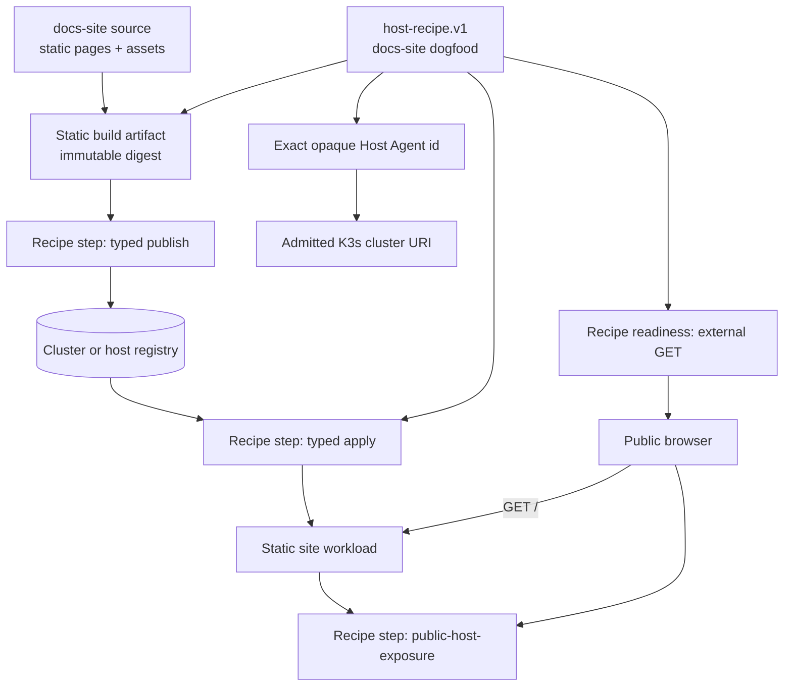

# Design: Host Agent docs and marketing site (dogfood-hosted)

## Context

See [proposal.md](proposal.md) for motivation. Today the Host Agent repository
ships a Go MCP server and README install notes; there is no product website and
no repository-owned dogfood that shows “this agent configured the cluster that
serves these docs.”

The Host Agent already owns typed paths for: guest/cluster lifecycle, OCI build
and push, Kubernetes apply, and provider-neutral public host exposure
(Cloudflare today; Tailscale Funnel as an alternate provider). This design
composes those paths for a static site; it does not invent a second deploy
plane.

## Goals / Non-Goals

**Goals:**

- Ship a static site that tells the Host Agent story and documents install,
  MCP clients, and the dogfood topology.
- Deploy and prove that site through a repository-owned Host Agent **recipe**
  end to end.
- Keep serving cheap and boring: static files behind a simple HTTP server
  workload and an existing public exposure provider.
- Separate “site is reachable” from any HA write-availability claim.

**Non-Goals:**

- SSR frameworks, edge functions, or Platform-backed content APIs.
- Using the site origin as Host Agent MCP administration.
- Encoding provider-specific Cloudflare or Tailscale commands in the recipe.
- Making an operator shell script the deploy path of record.

## Decision 1 — Static-first site package in this repository

The site lives under a dedicated tree in `opute-host-agent` (for example
`site/`). Build produces a directory of static assets with a content digest.
Framework choice is an implementation detail so long as:

- output is static files only;
- no secrets are baked into HTML;
- CI can rebuild reproducibly from a pinned toolchain.

**Alternatives considered:** hosting only on GitHub Pages (fails the dogfood
claim); a dynamic Next.js app on the cluster (unnecessary runtime); publishing
only into the sibling Opute web app (conflates Platform and Host Agent).

## Decision 2 — Dogfood deploy is a Host Agent recipe

Deployment MUST be a checked-in Host Agent recipe (prefer `host-recipe.v1`
with `execution.coordinator: host-agent`, consistent with other provider
recipes in this repository). The recipe is the product expression of dogfood
hosting; scripts may only invoke or evidence the recipe, never replace it.

The recipe MUST:

1. require an exact opaque Host Agent identity input;
2. require an admitted cluster URI input (not a node IP);
3. publish the site image/artifact via Host Agent build/push steps;
4. apply a namespaced static-site workload via typed capabilities;
5. bind public HTTPS through `public-host-exposure` (provider-neutral);
6. include or record external GET readiness against the published origin;
7. support ownership-scoped teardown for the generation it created.

The recipe MUST NOT call `kubectl`, `incus`, or provider CLIs directly.

**Alternatives considered:** manual kubectl apply of a checked-in YAML (does
not dogfood Host Agent); Platform-only deploy (proves Platform, not Host
Agent); operator TypeScript/shell that sequences MCP calls without a recipe
(not durable product surface, drifts from catalog).

## Decision 3 — One-node dogfood is enough; two-node is optional

Initial dogfood success is a reachable site on a Host Agent–managed cluster
with at least one ready server. If the operator later places the workload on a
two-server membership cluster, readiness reporting MUST still separate:

- site HTTP readiness;
- cluster membership;
- datastore / write availability (unchanged existing HA truth).

Serving the docs site on two nodes MUST NOT be narrated as consensus HA.

## Decision 4 — Cloudflare coexistence unchanged

Public exposure selects the existing provider-neutral contract. Cloudflare
remains valid. Tailscale Funnel remains an alternate provider where already
specified. The site recipe passes exposure bindings, not provider CLIs.

## Decision 5 — Content architecture

Minimum information architecture (routes are the *output* of context
gathering in Decision 6, not a substitute for it):

| Route | Job |
|-------|-----|
| `/` | Marketing: what Host Agent is, one CTA to install/docs |
| `/docs` | Docs hub |
| `/docs/install` | Binary / npm / standalone serve |
| `/docs/mcp-clients` | Streamable HTTP client config |
| `/docs/dogfood` | How this site is hosted via Host Agent |
| `/docs/capabilities` | Capability overview (links to contracts, not secrets) |

Marketing first viewport follows a single composition: brand-forward Host
Agent name, one headline, one supporting sentence, one CTA group, one
dominant visual. Docs pages prioritize scannable headings and copyable
config blocks.

## Decision 6 — Gather context before writing or reorganizing

Docs and IA MUST be derived from an explicit context packet, not from memory
or Platform marketing. Before drafting or restructuring pages, authors
produce (and keep with the site package) a short inventory that records:

1. **Audience jobs** — who the page is for (operator installing standalone
   Host Agent; MCP client author; dogfood reviewer) and the single job each
   route must complete.
2. **Source precedence** — in order: (a) this repository’s README, `make`
   / serve flags, and published package entrypoints; (b) Host Agent
   contracts, schemas, and ADRs under this repo; (c) OpenSpec changes that
   define Host Agent behavior; (d) live `tools/list` / capability catalog
   from a running Host Agent when documenting tool names; (e) sibling
   Opute docs only when labeled as Platform context and never as Host
   Agent install truth.
3. **Boundaries** — Host Agent vs Platform; private MCP vs public site
   origin; what the dogfood page may and may not claim.
4. **Verification hooks** — which command, file path, or live catalog
   field proves each factual claim (flags, default ports, client JSON).
5. **Redaction** — placeholders for tokens, and refusal to paste live
   kubeconfigs or mesh addresses as identity.

Reorganization of the nav or route map MUST re-run audience-job mapping
against that inventory; pages without a job are cut or merged. New claims
that cannot cite a source in the packet are blocked until the source is
added or the claim is dropped.

**Alternatives considered:** writing from the Platform site voice (blurs
products); scraping only `tools/list` without README/serve truth (misses
install); free-form blog posts without an inventory (undocumentable drift).

## Risks / Trade-offs

- **[Risk]** Dogfood deploy confused with Platform self-hosting → **Mitigation:**
  copy and specs state Host Agent–only hosting of static docs; Platform URLs
  are out of scope.
- **[Risk]** Node-pinned ingress URL treated as cluster identity → **Mitigation:**
  reuse `public-host-exposure` stability rules; record `stable=false` for
  node-specific endpoints.
- **[Risk]** Secrets in static HTML → **Mitigation:** build gate fails on
  token-like patterns; evidence redaction required.
- **[Risk]** Two-node marketing language overclaims HA → **Mitigation:**
  dogfood page MUST state availability boundary explicitly.

## Migration Plan

1. Land static site source and build in-repo; local preview only.
2. Add the dogfood Host Agent recipe against a non-production cluster URI.
3. Publish public origin when exposure readiness passes.
4. Rollback: delete only the generation-owned workload, ingress binding, and
   image tag recorded in evidence — no shared cluster teardown.

## Open Questions

- Exact public hostname (e.g. `host-agent.opute.io` vs a Funnel/Cloudflare
  generated URL) can be chosen at first dogfood without changing requirements,
  so long as the origin is recorded in evidence and classified for stability.
- Whether the static generator is Astro, Eleventy, or hand-authored HTML is
  deferred to implementation tasks; the static-output contract does not change.
